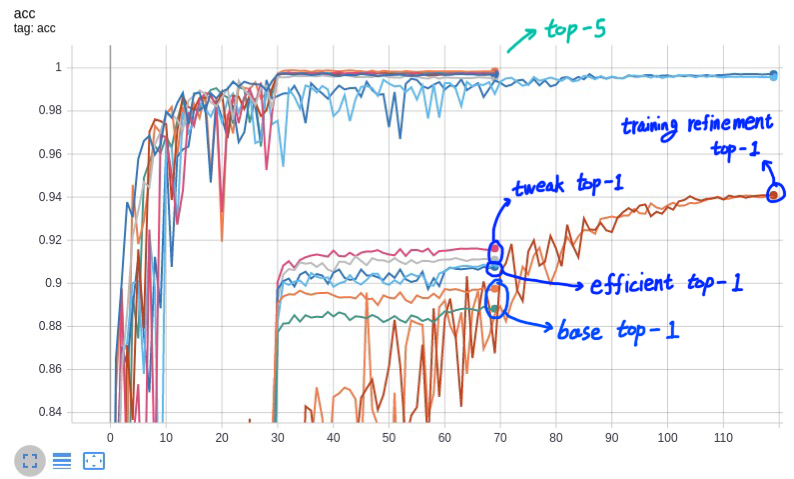

# Bag of Tricks for Image Classification with Convolutional Neural Networks

* paper : <https://arxiv.org/abs/1812.01187>

 여러 논문들에서 classification 성능 향상에 기여해왔으나 논문에 가볍게 언급되기만 하거나, 코드에서나 찾아볼 수 있던 트릭들을 정리하고,
 resnet-50 네트워크를 베이스로 하여 각 트릭들을 중첩해가며 성능향상 정도를 확인.
 
 
## 따라해보기
* cifar10 데이터셋
* 47 레이어 resnet 네트워크
* batch size : 256
* initial lr : .1 (exponential decay - rate : .1 / 30, 60, 90 epoch 마다 감소)
 
### 제시된 트릭들
* efficient training
  * linear scaling learning rate - 적용
  * learning rate warmup - 적용
  * batch normalization - gamma zero initialization - 적용
  * no bias decay - 적용
  * mixed precision training

* model tweaks
  * ResNet-C
  * ResNet-D - 적용
  
* training refinements
  * cosine learning rate decay - 적용
  * label smoothing - 적용
  * knowledge distillation
  * mixup training - 적용
  
### 결과

많은 트릭들을 중첩시켰을때 베이스보다 약 4% 성능 향상
